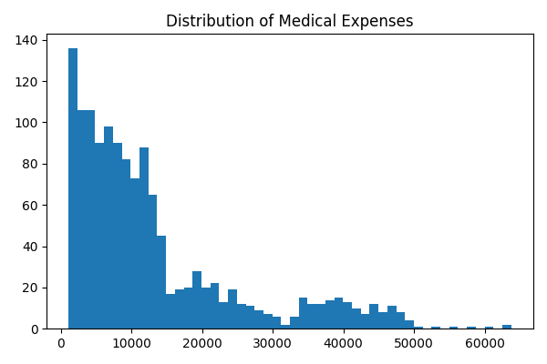
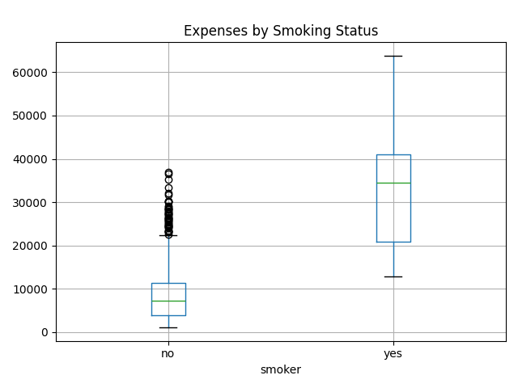
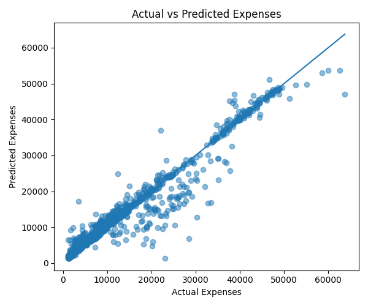

# Predicting Insurance Charges Using Machine Learning

## Business Objective

**Can patient demographic and lifestyle data be utilized to accurately anticipate medical insurance costs and enable automated, risk-based pricing?**

Insurance firms frequently experience information asymmetry when lifestyle-related hazards are not adequately represented in premium pricing.  
This study shows how machine learning can convert raw consumer data into a dependable financial forecasting and risk assessment system.

---

## Project Overview

This project builds an end-to-end predictive analytics pipeline to estimate individual medical insurance costs and identify key cost drivers using supervised machine learning.

The solution is designed to be:
- Accurate
- Interpretable
- Business-ready

---

## Technology Stack

- **Programming Language:** Python  
- **Libraries:** Pandas, NumPy, Matplotlib, Scikit-learn  
- **Model:** Random Forest Regressor  
- **Techniques Used:**
  - Exploratory Data Analysis (EDA)
  - Feature Encoding
  - Supervised Learning
  - Model Evaluation
  - Automated Excel Reporting

---

## Exploratory Data Analysis

### Distribution of Medical Expenses

The distribution of medical expenses is right-skewed, indicating the presence of a small number of high-cost individuals.

---

### Impact of Smoking on Medical Expenses

Smokers consistently incur significantly higher medical expenses compared to non-smokers, making smoking status a critical risk factor.

---

## Model Performance

### Actual vs Predicted Insurance Charges

The scatter plot below shows strong alignment between actual and predicted insurance charges, indicating good model performance and generalization.

### Key Performance Metrics

- **R² Score:** 0.85  
- **Mean Absolute Error (MAE):** Low average prediction error  
- **Root Mean Squared Error (RMSE):** Controlled deviation, even for high-cost cases  

---

## Conclusion

This study shows that medical insurance costs may be predicted with great accuracy using demographic and lifestyle data.

The Random Forest model accurately captures complex, non-linear interactions between variables like age, BMI, and smoking status.  
The model's **R² score of 0.85** suggests it explains the majority of the variability in insurance costs, making it appropriate for real-world pricing and risk assessment applications.

Key Findings:- Smoking is the most significant contributor of medical expenses.
- Age and BMI have a substantial impact on cost.
- Regional disparities exist, however they are secondary issues.

Overall, this study demonstrates how machine learning can help with data-driven premium pricing, cost optimization, and customer risk segmentation in the insurance sector.

---

## Business Recommendations
1. **Risk-Based Pricing:** Switch from flat premiums to tailored, risk-adjusted pricing models.  
2. **Wellness Incentives:** Promote healthier habits to lower long-term claim expenses.  
3. **Automated Quoting:** Integrate the model with digital channels to provide quick, data-backed insurance quotations.  
---

## Repository Structure

- `INSURANCE.py` – Complete Python pipeline (EDA → Modeling → Export)  
- `Insurance_Analytics_Project.xlsx` – Automated Excel output for stakeholders  
- `expenses_distribution.png` – Medical expense distribution visualization  
- `smoker_vs_expenses.png` – Impact of smoking on expenses  
- `actual_vs_predicted.png` – Model performance visualization  

---

## About the Author

**Palak Jain**  
M.Sc. in Applied Statistics  

I specialize in applying statistical analysis and machine learning techniques to transform complex datasets into actionable business insights.

- LinkedIn: https://linkedin.com/in/palak-jain-7a3b1b9248  
- Email: jainpalak190602@gmail.com
